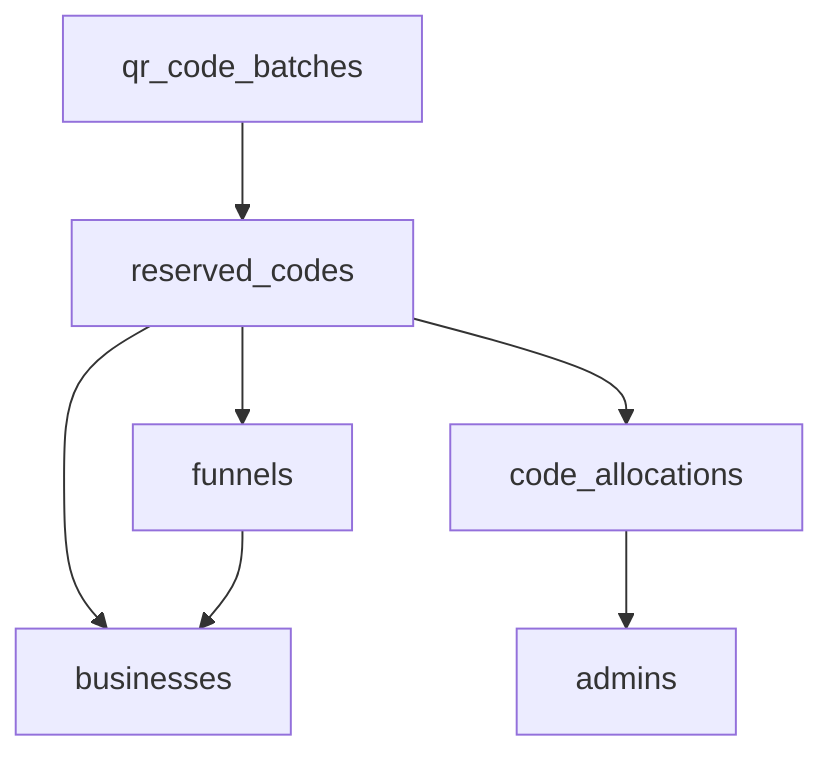

# QR Code Batch Admin Development Plan

## Executive Summary
This document outlines the development plan for a comprehensive admin interface to manage QR code batches and individual code assignments. The system will enable administrators to view batches, drill down to individual codes, assign codes to businesses/funnels, and maintain a complete audit trail.

## Current State Analysis

### What Exists
- **Database Schema**: Complete with all required tables (qr_code_batches, reserved_codes, code_allocations, etc.)
- **Basic Admin Page**: `/admin/qr-batches` showing batch list and inventory overview
- **Batch Creation**: Admin can create new batches
- **Status Management**: Batches can be moved through status workflow (generated → printing → shipped → active)

### What's Missing
- **Batch Detail View**: No way to see individual codes within a batch
- **Code Assignment**: Cannot assign codes to businesses/funnels from admin
- **Code Management**: No UI for viewing code status or history
- **Audit Trail**: Database supports it but no UI to view allocation history
- **Bulk Operations**: No way to manage multiple codes at once

## System Architecture

### Page Hierarchy
```
/admin/qr-batches (existing - batch list)
│
├── /admin/qr-batches/[batchId] (new - batch detail)
│   ├── Batch information header
│   ├── Code statistics
│   ├── Code list table
│   └── Bulk operations toolbar
│
└── /admin/qr-batches/[batchId]/codes/[codeId] (new - code detail)
    ├── Code information
    ├── Current assignment
    ├── Assignment history
    └── Management actions
```

### Component Structure
```
components/admin/
├── BatchDetailHeader.tsx       # Batch info and stats
├── CodeTable.tsx               # List of codes with filters
├── CodeAssignmentModal.tsx     # Assign code to business/funnel
├── CodeDetailModal.tsx         # View code details and history
├── BusinessSelector.tsx        # Search and select business
├── FunnelSelector.tsx         # Select funnel for business
└── BulkOperationsToolbar.tsx  # Bulk actions for selected codes
```

## Database Design

### Key Relationships


### Status Flow
```
available → reserved (temp) → assigned → available (if unassigned)
         ↘                  ↗
           damaged/lost (permanent)
```

### Required Database Functions

#### 1. Atomic Code Assignment
```sql
CREATE OR REPLACE FUNCTION assign_code_to_funnel(
  p_code_id UUID,
  p_funnel_id UUID,
  p_admin_id UUID
) RETURNS JSONB AS $$
-- Atomically assigns a code to a funnel with validation
-- Returns success status and error message if failed
```

#### 2. Safe Code Release
```sql
CREATE OR REPLACE FUNCTION release_code_from_funnel(
  p_code_id UUID,
  p_admin_id UUID,
  p_reason TEXT DEFAULT NULL
) RETURNS JSONB AS $$
-- Safely removes code from funnel assignment
-- Logs the action with reason
```

## Feature Specifications

### 1. Batch Detail Page

#### URL: `/admin/qr-batches/[batchId]`

#### Features:
- **Header Section**
  - Batch name and number
  - Status badge with color coding
  - Creation date and creator
  - Quick stats (total, available, assigned, damaged)

- **Code Table**
  - Columns: Code, Status, Business, Funnel, Funnel Status, Assigned Date, Actions
  - Sortable by all columns
  - Filterable by status
  - Search by code or business name
  - Pagination (50 codes per page)

- **Actions per Code**
  - View Details
  - Assign (if available)
  - Unassign (if assigned)
  - Mark as Damaged/Lost
  - View History

- **Bulk Operations**
  - Select multiple codes via checkboxes
  - Export selected to CSV
  - Assign to single business (multiple funnels)
  - Mark selected as damaged

### 2. Code Assignment Modal

#### Workflow:
1. **Select Business**
   - Search by name or email
   - Display business info (name, email, funnel count)
   - Show recent businesses for quick selection

2. **Select Funnel**
   - Dropdown populated after business selection
   - Show funnel name, status, and creation date
   - Filter to show only draft/active funnels
   - Option to create new funnel (redirect)

3. **Confirm Assignment**
   - Display summary: Code → Business → Funnel
   - Warning if funnel already has a code
   - Confirm button with loading state
   - Success/error feedback

#### Validation Rules:
- Code must be status='available'
- Funnel must belong to selected business
- Funnel cannot already have a reserved code
- Admin must be authenticated

### 3. Code Unassignment Modal

#### Features:
- Display current assignment details
- Optional reason field for audit trail
- Warning about impact on funnel
- Confirm with "Unassign" button
- Success feedback with code returning to available

### 4. Code History View

#### Information Displayed:
- Timeline of all status changes
- Admin who made each change
- Timestamp for each action
- Reason (if provided)
- Previous and new status
- Associated business/funnel at time of action

### 5. Business/Funnel Selectors

#### Business Selector:
- Autocomplete search (min 2 characters)
- Show top 10 results
- Display: Name, Email, Type, Funnel Count
- Recent selections cached

#### Funnel Selector:
- Dropdown list of business's funnels
- Group by status (Active, Draft, Archived)
- Show: Name, Status, Created Date, Current Code (if any)
- Disable if no business selected

## API Endpoints

### 1. Get Batch Codes
```
GET /api/admin/qr-codes/batches/[batchId]/codes
Query params:
  - status: available|assigned|reserved|damaged|lost
  - search: string (code or business name)
  - page: number
  - limit: number (default 50)
  - sort: column_name
  - order: asc|desc

Response:
{
  codes: [{
    id, code, status, business_id, business_name,
    funnel_id, funnel_name, funnel_status,
    assigned_at, updated_at
  }],
  pagination: { total, page, limit, pages }
}
```

### 2. Assign Code
```
POST /api/admin/qr-codes/assign
Body:
{
  codeId: string,
  funnelId: string
}

Response:
{
  success: boolean,
  message: string,
  code?: { id, code, status, funnel_id, business_id }
}
```

### 3. Unassign Code
```
POST /api/admin/qr-codes/unassign
Body:
{
  codeId: string,
  reason?: string
}

Response:
{
  success: boolean,
  message: string
}
```

### 4. Search Businesses
```
GET /api/admin/businesses/search
Query params:
  - q: string (search term)
  - limit: number (default 10)

Response:
{
  businesses: [{
    id, name, email, type,
    funnel_count, created_at
  }]
}
```

### 5. Get Business Funnels
```
GET /api/admin/businesses/[businessId]/funnels
Query params:
  - status: active|draft|archived
  - has_code: boolean

Response:
{
  funnels: [{
    id, name, status, type,
    code_source, reserved_code_id,
    short_url, created_at
  }]
}
```

### 6. Get Code History
```
GET /api/admin/qr-codes/[codeId]/history

Response:
{
  code: { id, code, current_status },
  history: [{
    action, previous_status, new_status,
    business_name, funnel_name,
    admin_name, created_at, reason
  }]
}
```

## UI/UX Design

### Visual Design System

#### Status Colors:
- **Available**: Green (#10B981)
- **Assigned (Draft)**: Blue (#3B82F6)
- **Assigned (Active)**: Purple (#8B5CF6)
- **Reserved**: Orange (#F59E0B)
- **Damaged/Lost**: Red (#EF4444)

#### Interactive Elements:
- **Primary Actions**: Mint color from brand
- **Destructive Actions**: Red with confirmation
- **Bulk Selection**: Checkbox with select all option
- **Loading States**: Spinner with disabled buttons
- **Success Feedback**: Green toast notification
- **Error Feedback**: Red toast with error details

### Table Design:
```
┌─┬────────────┬──────────┬────────────┬────────────┬───────────┬──────────┬─────────┐
│□│    Code    │  Status  │  Business  │   Funnel   │Funnel St. │ Assigned │ Actions │
├─┼────────────┼──────────┼────────────┼────────────┼───────────┼──────────┼─────────┤
│□│ PPjCcGbN   │ Available│     -      │     -      │     -     │    -     │[Assign] │
│□│ PPeKI8ed   │ Assigned │Steele Plum │ 19-22 Sep  │  Active   │ 2d ago   │[View]   │
└─┴────────────┴──────────┴────────────┴────────────┴───────────┴──────────┴─────────┘
```

### Modal Layouts:

#### Assignment Modal:
```
┌─────────────────────────────────────┐
│ Assign Code: PPjCcGbN            X │
├─────────────────────────────────────┤
│ 1. Select Business                  │
│ ┌─────────────────────────────────┐ │
│ │ 🔍 Search businesses...         │ │
│ └─────────────────────────────────┘ │
│                                     │
│ 2. Select Funnel                    │
│ ┌─────────────────────────────────┐ │
│ │ ▼ Choose a funnel               │ │
│ └─────────────────────────────────┘ │
│                                     │
│ [Cancel]              [Assign Code] │
└─────────────────────────────────────┘
```

## Security & Permissions

### Admin Role Permissions:
- **super_admin**: All operations including delete
- **admin**: View, assign, unassign, export
- **support**: View only, no modifications

### Audit Requirements:
- Log every assignment/unassignment
- Capture admin ID, timestamp, IP address
- Store reason for manual actions
- Maintain complete history even after code deletion

### Security Measures:
- Row-level security on all tables
- Admin authentication required
- CSRF protection on all mutations
- Rate limiting on bulk operations
- Validation of all inputs server-side

## Implementation Phases

### Phase 1: Core Infrastructure (Day 1)
**Goal**: Basic batch detail page with code listing

Tasks:
1. Create `/admin/qr-batches/[batchId]` page
2. Implement code fetching API endpoint
3. Build CodeTable component
4. Add status filtering
5. Implement pagination
6. Add search functionality

**Deliverables**:
- Working batch detail page
- Ability to view all codes in a batch
- Basic filtering and search

### Phase 2: Assignment System (Day 2)
**Goal**: Complete code assignment workflow

Tasks:
1. Create CodeAssignmentModal component
2. Build BusinessSelector with search
3. Implement FunnelSelector component
4. Create assign/unassign API endpoints
5. Add database functions for atomic operations
6. Implement success/error handling

**Deliverables**:
- Working assignment modal
- Ability to assign codes to funnels
- Proper validation and error handling

### Phase 3: Management Features (Day 3)
**Goal**: Advanced management capabilities

Tasks:
1. Build CodeDetailModal with history
2. Implement bulk operations toolbar
3. Create bulk assignment workflow
4. Add export functionality
5. Implement mark as damaged/lost
6. Build audit trail viewer

**Deliverables**:
- Bulk operations on multiple codes
- Complete code history viewing
- Export capabilities

### Phase 4: Polish & Testing (Day 4)
**Goal**: Production-ready system

Tasks:
1. Add loading states and optimistic updates
2. Implement proper error boundaries
3. Add confirmation dialogs
4. Performance optimization
5. Write integration tests
6. Documentation

**Deliverables**:
- Polished, production-ready UI
- Complete test coverage
- Admin documentation

## Success Metrics

### Functional Requirements:
- ✅ View all codes in a batch
- ✅ Filter codes by status
- ✅ Search codes by code or business
- ✅ Assign available codes to funnels
- ✅ Unassign codes from funnels
- ✅ View complete assignment history
- ✅ Bulk operations on multiple codes
- ✅ Export code data

### Performance Requirements:
- Page load < 2 seconds
- Search results < 500ms
- Assignment operation < 1 second
- Support 10,000+ codes per batch
- Concurrent admin support

### Quality Requirements:
- Zero data corruption
- Complete audit trail
- No double assignments
- Graceful error handling
- Mobile-responsive design

## Testing Strategy

### Unit Tests:
- Component rendering
- API endpoint validation
- Database function logic
- Status transition rules

### Integration Tests:
- Complete assignment workflow
- Bulk operations
- Search and filtering
- Export functionality

### E2E Tests:
- Full admin journey
- Error scenarios
- Concurrent operations
- Permission checks

## Risk Mitigation

### Technical Risks:
- **Race Conditions**: Use database locks and atomic operations
- **Performance**: Implement pagination and lazy loading
- **Data Integrity**: Use transactions for all multi-step operations

### Business Risks:
- **Accidental Unassignment**: Require confirmation and reason
- **Bulk Errors**: Process in transactions with rollback
- **Audit Compliance**: Immutable audit log with complete history

## Documentation Requirements

### Admin Guide:
- How to navigate to batch details
- Assignment workflow walkthrough
- Bulk operations guide
- Troubleshooting common issues

### API Documentation:
- Endpoint specifications
- Request/response examples
- Error code reference
- Rate limit information

### Developer Documentation:
- Component API reference
- Database schema
- Security considerations
- Deployment guide

## Next Steps

1. **Immediate Actions**:
   - Set up batch detail page route
   - Create API endpoint structure
   - Begin CodeTable component

2. **Week 1 Goals**:
   - Complete Phase 1 & 2
   - Basic assignment working
   - Initial testing

3. **Week 2 Goals**:
   - Complete Phase 3 & 4
   - Full feature set
   - Production deployment

## Conclusion

This plan provides a comprehensive solution for QR code batch administration with:
- Intuitive navigation from batches to individual codes
- Robust assignment system with validation
- Complete audit trail for compliance
- Efficient bulk operations
- Scalable architecture

The phased approach ensures incremental delivery of value while maintaining system stability and data integrity throughout development.